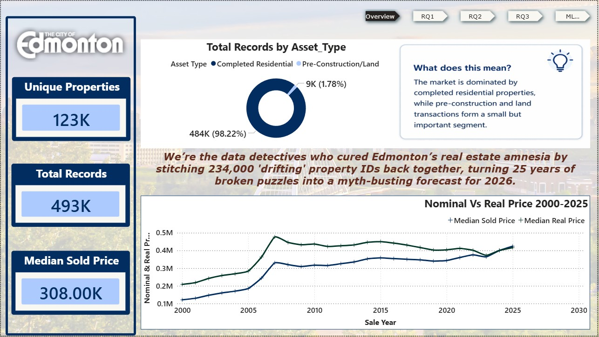
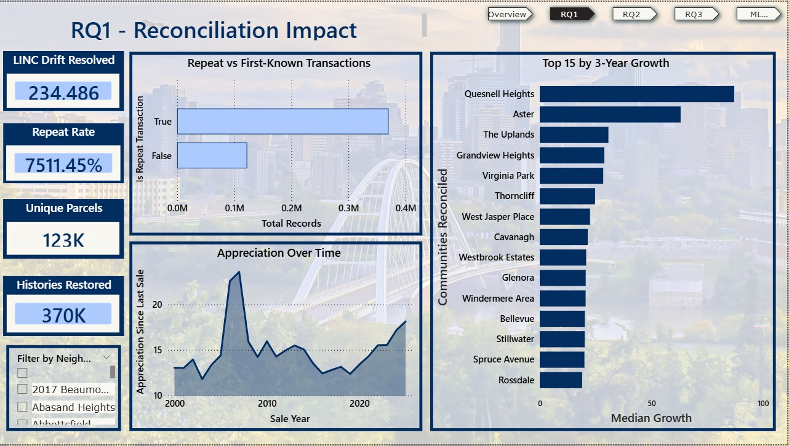
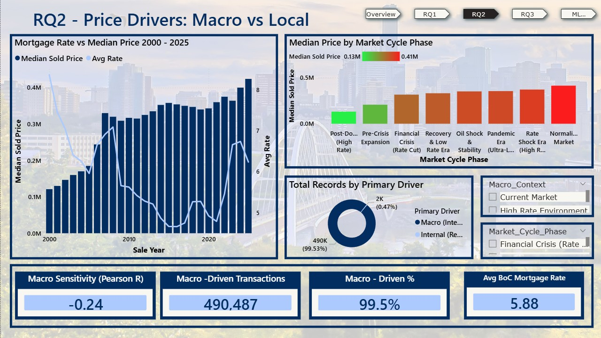
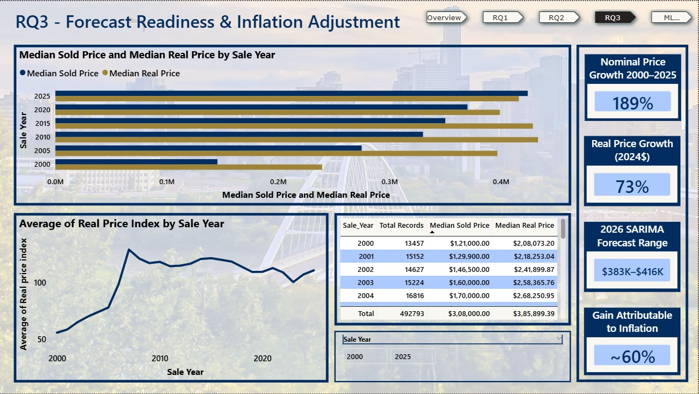
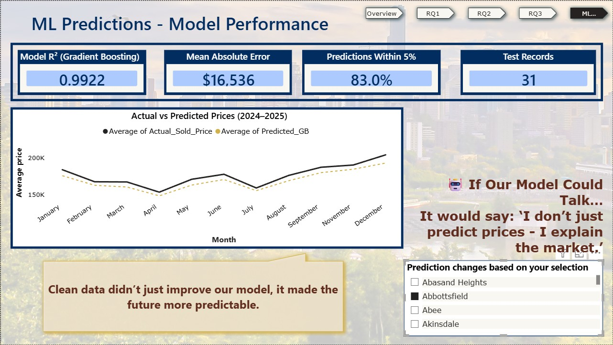

# Edmonton Residential Real Estate: Data Engineering, ML & Forecasting

**Turning 25 years and 515,000+ fragmented property records into a reconciled, modeling-ready dataset — then using it to answer three real business questions about the Edmonton housing market.**

   

---

## Overview

Real estate forecasting models often fail not because of weak algorithms, but because of broken underlying data — fragmented identifiers, inconsistent addresses, and administrative noise that silently corrupt long-term trends. This project tackles that problem head-on for Edmonton's residential real estate market (2000–2025).

Working with 515,122 raw transaction records, I designed an **8-stage ETL pipeline** to resolve identifier drift, standardize addresses, isolate ghost transactions, and geocode every record — producing a clean, 492,793-record dataset. That dataset then powers three machine learning models, a SARIMA forecasting comparison, and an interactive Power BI dashboard.

> This was completed as a capstone project for the NAIT Data Analytics Program (Group 5). My individual contributions centered on the ETL pipeline design, the 5-layer geocoding system, feature engineering (F1–F5), and the Power BI dashboard build — see [My Role](#my-role) below for details.

---

## Key Results

| Metric | Result |
|---|---|
| Raw records processed | 515,122 → **492,793** modeling-ready |
| LINC identifier drift instances resolved | **234,486** (65.66% efficiency) |
| Repeat transaction chains restored | **370,159** (75.1% of dataset) |
| Geocoding coverage | **100%** via custom 5-layer offline pipeline |
| Best model (Gradient Boosting) | **R² = 0.9922**, MAE = $16,536 |
| Predictions within 5% of actual price | **83.0%** |
| 2026 price forecast (SARIMA, constant 2024$) | **$415,555 – $448,260** |

---

## Dashboard

Built in Power BI with four linked pages, each answering one research question with live filters for year, neighbourhood, and market cycle.

**Overview**


**RQ1 — Reconciliation Impact:** How much history was recovered by fixing broken property identifiers?


**RQ2 — Price Drivers: Macro vs. Local:** Are prices driven mainly by interest rates, or local factors?


**RQ3 — Forecast Readiness & Inflation Adjustment:** What's the real (inflation-adjusted) 2026 price forecast?


**ML Predictions — Model Performance:** How accurate are the price predictions, and where do they break down?


---

## Research Questions & Findings

**RQ1 — Does reconnecting fragmented property histories improve long-term appreciation measurement?**
Yes. A custom `Base_Address` reconciliation strategy resolved 234,486 identifier drift instances, restoring 370,159 repeat-sale chains that would otherwise have been invisible to any model — turning artificially "young" properties back into their true multi-decade histories.

**RQ2 — Are Edmonton prices driven more by macroeconomic forces or local factors?**
Overwhelmingly macro. 99.5% of transactions are macro-driven (Price Ratio ≤ 1.25), with mortgage rate showing a significant negative correlation to price (Pearson R = −0.238, p < 0.001). An ANOVA across 8 market-cycle phases confirmed a large, statistically significant effect (F = 16,194.68, p < 0.001).

**RQ3 — How much does forecast accuracy improve with reconciled vs. raw data?**
An AIC-optimized SARIMA(2,1,2)(1,1,1,12) model was benchmarked against random-walk and seasonal-naive baselines. Both reconciled and raw-data models beat the random walk, and the reconciled model produced a defensible, inflation-adjusted 2026 forecast range — while honestly reporting where it underperformed simpler benchmarks in flat-market periods.

---

## Technical Approach

### 8-Stage ETL Pipeline

| Stage | Process | Result |
|---|---|---|
| 1 | Data ingestion (latin1 encoding, multi-system source) | 515,122 records loaded |
| 2 | Column standardization | 57 columns cleaned & validated |
| 3 | Datetime coercion | 18 corrupt records removed |
| 4 | Neighbourhood crosswalk (Oliver → Wîhkwêntôwin) | 9,357 records reclassified |
| 5 | `Base_Address` engineering (LINC drift resolution) | 122,634 unique physical parcels identified |
| 6 | Ghost asset classification | 9,246 pre-construction records isolated |
| 7 | 5-layer offline geocoding | 100% spatial coverage, 0 API calls |
| 8 | Bank of Canada mortgage rate sync (`merge_asof`) | 1,362 weekly rate observations merged, 0 nulls |

### Feature Engineering (F1–F5)

Five engineered features connect the cleaned pipeline directly to each research question — a macro/internal price-driver classifier, rolling 3-year neighbourhood growth, named market-cycle phases, repeat-sale appreciation tracking, and an inflation-adjusted real price index (CPI-deflated).

### Machine Learning

Three models were trained and compared using a **temporal holdout split** (train: 2000–2023, test: 2024–2025) rather than k-fold cross-validation, to avoid leaking future data into training — the methodologically correct approach for time-series regression.

| Model | R² | MAE | Within 5% |
|---|---|---|---|
| OLS Regression | 0.952 | $35,206 | 41.3% |
| Random Forest | 0.983 | $20,996 | 78.4% |
| **Gradient Boosting** | **0.9922** | **$16,536** | **83.0%** |

### Forecasting

SARIMA(2,1,2)(1,1,1,12), selected via AIC grid search, was used to compare forecast accuracy on reconciled vs. fragmented data, benchmarked against random-walk and seasonal-naive baselines — including an honest report of where SARIMA underperformed simpler methods.

---

## Tech Stack

`Python` · `pandas` · `NumPy` · `scikit-learn` · `statsmodels` (SARIMA) · `Power BI` (DAX) · `Streamlit` · Bank of Canada & Statistics Canada open data APIs

---

## Repository Structure

```
edmonton-real-estate-analytics/
├── README.md
├── notebooks/
│   ├── README.md
│   ├── 01_etl_pipeline.ipynb                    # 8-stage ingestion, cleaning, LINC reconciliation
│   ├── 02_feature_engineering_geocoding.ipynb   # F1–F5 features + 5-layer geocoding pipeline
│   ├── 03_modeling_and_forecasting_final.ipynb  # OLS / RF / Gradient Boosting + SARIMA (final results)
│   └── earlier-iterations/                       # earlier modeling drafts, kept to show iteration
├── docs/
│   ├── Final_Capstone_Report.pdf                 # Full technical report
│   └── Artefacts_Requirements.pdf                # Data science lifecycle documentation
└── assets/
    └── (dashboard screenshots)
```

This repo covers the **entire pipeline** — data engineering, feature engineering, modeling, and forecasting — with runnable notebooks, not just the final Power BI dashboard.

> **Note:** Raw data files are omitted in line with academic data-sharing requirements. The notebooks are included so the methodology is fully reviewable.

---

## How to View / Reproduce

1. **Report:** Open `docs/Final_Capstone_Report.pdf` for the full write-up.
2. **Dashboard:** Download `dashboard/Edmonton-RealEstate-Dashboard.pbit` and open it in **Power BI Desktop**. Since the underlying data is private/academic, visuals reflect a snapshot of the analysis rather than a live data connection.
3. **Pipeline & modeling code:** Start with `notebooks/01_etl_pipeline.ipynb`, then `02_feature_engineering_geocoding.ipynb`, then `03_modeling_and_forecasting_final.ipynb` for the full step-by-step methodology.

---

## Limitations (Reported Honestly)

- Sale_Year shows extreme collinearity with the inflation-adjusted price index (VIF = 560.51) — high model R² partly reflects trend extrapolation, not pure causal signal
- The SARIMA forecast underperforms a simple seasonal-naive baseline in flat-market periods — reported transparently rather than hidden
- ~16% of records rely on imputed (city-centre default) geocoding and are excluded from spatial modeling
- Address-stripping logic carries some over-matching risk in high-density buildings; mitigated by restricting repeat-sale analysis to single-family properties in later iterations

---

---

## Data Source & Privacy

The dataset was provided by an academic partner for coursework analysis and is **not included** in this repository to comply with data privacy and academic guidelines. This repo showcases the methodology, code structure, findings, and dashboard as a demonstration of the analytical work performed.

---

## My Role

This was a team capstone (Group 5, NAIT DATA 3960). My primary contributions:
- Designed and implemented the 8-stage ETL pipeline and the custom 5-layer offline geocoding system
- Built the F1–F5 engineered features connecting the cleaned data to each research question
- Built the Power BI dashboard (DAX measures, four linked report pages, slicers)
- Co-developed the machine learning model comparison and SARIMA forecasting validation

---

## Contact

**Shardul Parekh**
📍 Edmonton, AB · ✉️ shardulparekh19@gmail.com · [LinkedIn](https://www.linkedin.com/)
